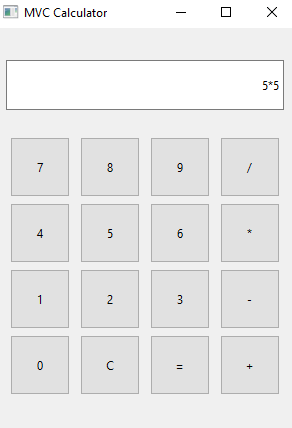
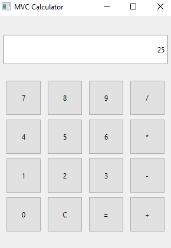
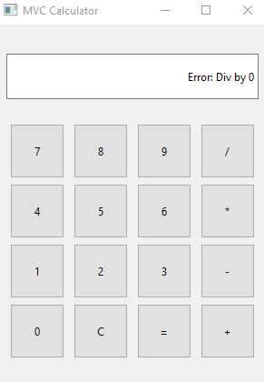

# 🧮 PyQt6 MVC Calculator

Простое и элегантное приложение-калькулятор, построенное на архитектуре **Model-View-Controller (MVC)**.

## 📌 Особенности
- **Разделение логики:** Математические вычисления отделены от графического интерфейса.
- **Интерфейс на PyQt6:** Использование `QGridLayout` для адаптивного расположения кнопок.
- **Обработка ошибок:** Корректная обработка деления на ноль и неверных выражений.

## 📂 Структура проекта
- `model.py` — Логика калькулятора (Модель).
- `view_ctrl.py` — Интерфейс и управление (Вид и Контроллер).
- `main.py` — Точка входа для запуска приложения.
- `requirements.txt` — Список зависимостей.

## Screenshots
### Calculation Example


### Result of Calculation


### Result of Calculation


## 🛠 Установка и запуск

pip install -r requirements.txt

python main.py

1. **Клонируйте репозиторий:**
   ```bash
   git clone https://github.com/askarsltv17/mvc-pyqt-calculator.git
   
